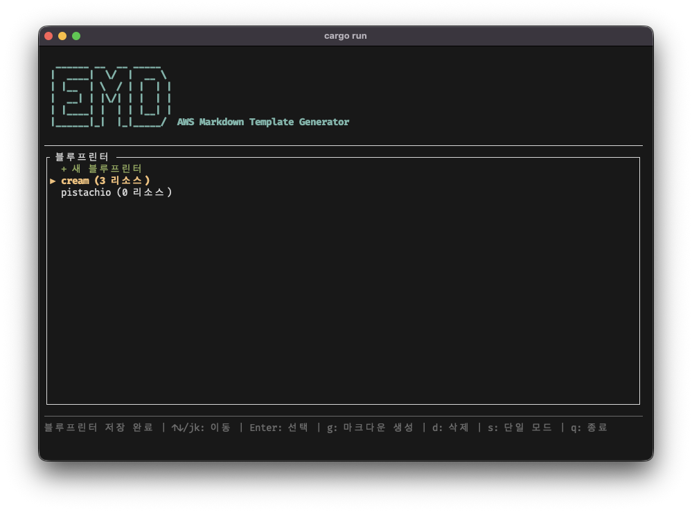

# EMD

[🇺🇸 English](README.md) | [🇰🇷 한국어](README.ko.md)



`emd` is a Terminal User Interface (TUI) application designed to explore your AWS resources and generate comprehensive Markdown documentation.

## Features

- **Resource Exploration**: Easily browse EC2 instances, VPCs (Networks), Security Groups, and Load Balancers.
- **Blueprinter**: Select multiple resources across different regions and services to create a single, unified documentation blueprint.
- **Markdown Generation**: Automatically generate detailed Markdown documentation for selected resources, complete with network diagrams (Mermaid.js).
- **TUI Interface**: A user-friendly terminal interface built with `ratatui`.

## Usage

Run the application:

```bash
cargo build --release
./target/release/emd
```


## Configuration

Blueprints are saved locally in:
`~/.emd/blueprints.json`

